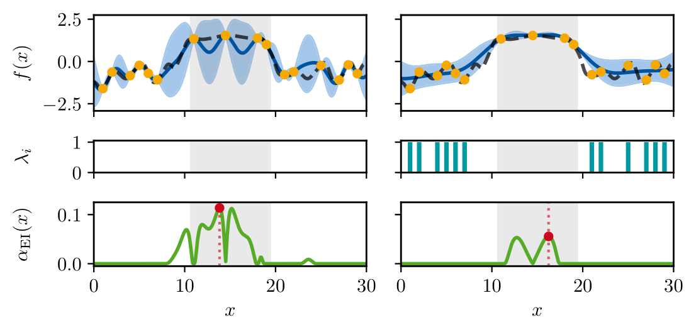

# Reducing the Influence of Model Mismatch in Bayesian Optimization Through Targeted Noise Injection

This repository accompanies my Bachelor's thesis, written at the Institute of Data Science in Mechanical Engineering under the supervision of Paul Brunzema and Prof. Sebastian Trimpe. It provides code for implementing **targeted noise injection** in Bayesian Optimization (BO), a technique developed to improve optimization under model mismatch. The method treats observation noise as a tunable modeling parameter and adaptively down-weights misleading data points using a novel **multiplicative Gaussian likelihood**.

<p align="center">
  
</p>
<p align="center"><small>
  This figure illustrates the effect of trust region noise injection. Left: A
  standard GP, which weights all data uniformly, produces a
  compromised posterior fit within the active trust region (gray area)
  due to influential outlying observations. Right: The proposed method
  injects noise into observations outside the trust region, down-weighting
  their influence. This results in a more accurate local posterior and a
  more focused acquisition function. Panels depict the GP posterior
  (top), per-point noise allocation λi (middle), and the resulting EI
  acquisition function (bottom).
</small></p>

The code supports several strategies for noise optimization, including **gradient-based tuning**, **iterated local search**, and a **beam search framework**. A **trust region-guided variant** further restricts noise injection to regions outside the current search area, helping the model focus on relevant input space regions.

We evaluate the method on synthetic optimization benchmarks, showing improved performance compared to standard output transformations and BO baselines.

The repository includes full implementations of the proposed methods, configuration files, and scripts to reproduce the results.

## Project Overview

This project provides a modular Hydra-based framework to systematically evaluate targeted noise injection strategies in BO. It enables flexible combinations of BO algorithms, GP surrogate models, and noise optimization techniques, as detailed in the configuration table below.

### Key Components

- **BO Algorithms** (`src/optim/`)
  - `vanilla_bo.py`: Standard BO with EI or UCB acquisition functions.
  - `trustregion_bo.py`: Trust region variant based on TuRBO.

- **GP Models** (`src/models/`)
  - `vanilla_gp.py`: Standard GP model using GPyTorch.
  - `heuristic_noiseinjection_gp.py`: Heuristic per-point noise injection.
  - `trustregion_noiseinjection_gp.py`: Localized injection outside trust regions.

- **Noise Optimization** (`src/models/noise_optimizers.py`)
  - Supports naive MLL tuning, gradient-based optimization, ILS, and beam search.

- **Likelihood Function**
  - `multiplicative_gaussian_likelihood.py`: Custom likelihood for per-point noise scaling.

- **Beam Search Framework**
  - `beam_search.py`: Unified engine supporting heuristic and trust region search strategies.

- **Transformations & Utilities**
  - Preprocessing transforms and helper functions.

### Evaluated Configurations

All evaluated methods are combinations of the following dimensions:

| Method | Optimizer | GP Model | Transformation | Noise Optimization | Initialization | GP Refitting | Normalization | Force Noise | Noise Optional |
|--------|-----------|----------|----------------|--------------------|----------------|---------------|---------------|-------------|----------------|
| `bo_plain` | VanillaBO | VanillaGP | None | None | - | - | - | - | - |
| `bopt_standardize` | VanillaBO | VanillaGP | PT Standardize | None | - | - | - | - | - |
| `boot_standardize` | VanillaBO | VanillaGP | OT Standardize | None | - | - | - | - | - |
| `boot_log` | VanillaBO | VanillaGP | OT Log | None | - | - | - | - | - |
| `boot_bilog` | VanillaBO | VanillaGP | OT Bilog | None | - | - | - | - | - |
| `bopt_log` | VanillaBO | VanillaGP | PT Log | None | - | - | - | - | - |
| `bopt_bilog` | VanillaBO | VanillaGP | PT Bilog | None | - | - | - | - | - |
| `boni_plain` | VanillaBO | Heuristic GP | None | Naive | Noise | - | - | - | - |
| `boni_plainnonoise` | VanillaBO | Heuristic GP | None | Naive | No noise | - | - | - | - |
| `boni_standardize` | VanillaBO | Heuristic GP | PT Standardize | Naive | Noise | - | - | - | - |
| `boni_standardizenonoise` | VanillaBO | Heuristic GP | PT Standardize | Naive | No noise | - | - | - | - |
| `boni_standardizenonoiserefit` | VanillaBO | Heuristic GP | PT Standardize | Naive | No noise | true | - | - | - |
| `boni_standardizegradient` | VanillaBO | Heuristic GP | PT Standardize | Gradient | No noise | - | - | - | - |
| `boni_standardizegradientbinary` | VanillaBO | Heuristic GP | PT Standardize | Binary Gradient | No noise | - | - | - | - |
| `boni_ilsstandardize` | VanillaBO | Heuristic GP | PT Standardize | ILS | Noise | - | - | - | - |
| `boni_ilsstandardizenonoise` | VanillaBO | Heuristic GP | PT Standardize | ILS | No noise | - | - | - | - |
| `boni_ilsstandardizenonoiserefit` | VanillaBO | Heuristic GP | PT Standardize | ILS | No noise | true | - | - | - |
| `boni_bsnoise` | VanillaBO | Heuristic GP | PT Standardize | Beam Search | Noise | - | - | - | - |
| `boni_bsnonoise` | VanillaBO | Heuristic GP | PT Standardize | Beam Search | No noise | - | - | - | - |
| `boni_standardizeones` | VanillaBO | BaseNoiseInjectionGP | PT Standardize | Naive | Noise | - | - | - | - |
| `boni_standardizezeros` | VanillaBO | BaseNoiseInjectionGP | PT Standardize | Naive | No noise | - | - | - | - |
| `turbo_plain` | TrustRegionBO | VanillaGP | None | None | - | - | - | - | - |
| `turbo_standardize` | TrustRegionBO | VanillaGP | PT Standardize | None | - | - | - | - | - |
| `turboni_standardize` | TrustRegionBO | Heuristic GP | PT Standardize | Naive | No noise | - | - | - | - |
| `turboni_tr` | TrustRegionBO | Trust Region GP | PT Standardize | Naive | - | - | - | - | - |
| `turboni_trbinary` | TrustRegionBO | Trust Region GP | PT Standardize | Naive | - | - | - | - | true |
| `turboni_tradditive` | TrustRegionBO | Beam Search GP | PT Standardize | Beam Search | - | - | - | true | - |
| `turboni_tradditivenorm` | TrustRegionBO | Beam Search GP | PT Standardize | Beam Search | - | - | true | true | - |
| `turboni_trbs` | TrustRegionBO | Beam Search GP | PT Standardize | Beam Search | - | - | - | - | - |
| `turboni_trbsnorm` | TrustRegionBO | Beam Search GP | PT Standardize | Beam Search | - | - | true | - | - |

Each method evaluates a specific combination of BO algorithm, GP model, preprocessing transform, noise optimization strategy, and initialization settings.

**Column Explanations:**
- **Transformation**: PT (Preprocessing Transform) applies data transformation before GP fitting and acquisition function evaluation; OT (Outcome Transform) uses built-in BoTorch outcome transformation applied only during GP fitting.
- **Initialization**: Sets all noise factors to 1.0 (Noise) or 1e-6 (No noise) at start.
- **GP Refitting**: If true, GP hyperparameters are retrained after each noise update.
- **Force Noise**: If true, enforces a minimum noise value for injected points.
- **Noise Optional**: If true, noise is only injected outside the trust region.

### Objective Functions

The evaluation covers a comprehensive set of synthetic optimization benchmarks:

- **Low-dimensional functions**: Branin (2D), Hartmann3D (3D), Ackley2D (2D), Rastrigin2D (2D)
- **Medium-dimensional functions**: Ackley10D (10D), Rastrigin10D (10D), Hartmann6D (6D)
- **High-dimensional functions**: Ackley20D (20D), Rastrigin20D (20D), Ackley100D (100D)

## Repository Structure

```
config/                                     Hydra configuration for objectives, optimizers and paths
notebooks/                                  Jupyter notebooks illustrating experiments
plots/                                      Helper scripts to visualize results
results/                                    Output directory for optimization runs
scripts/run.py                              Main entry point to start an optimization run
src/                                        
 ├─ models/                                 GP models with noise injection capabilities
 │   ├─ base_noiseinjection_gp.py           Base class for noise injection models
 │   ├─ heuristic_noiseinjection_gp.py      Heuristic-based noise injection
 │   ├─ noise_optimizers.py                 Noise optimization algorithms (naive, ILS, beam search, gradient)
 │   ├─ trustregion_noiseinjection_gp.py    Trust region localized noise injection
 │   └─ vanilla_gp.py                       Standard GP model
 ├─ optim/                                  Bayesian optimization algorithms
 │   ├─ base_bo.py                          Base BO class with common functionality
 │   ├─ trustregion_bo.py                   Trust region BO (TuRBO-style)
 │   └─ vanilla_bo.py                       Standard BO implementation
 ├─ utils/                                  Utility functions and helpers
 │   ├─ constants.py                        Shared configuration constants
 │   └─ utils.py                            Common utilities and helper functions
 ├─ beam_search.py                          Centralized beam search framework for noise optimization
 ├─ multiplicative_gaussian_likelihood.py   Custom likelihood for noise scaling
 └─ transformations.py                      Data preprocessing transformations
```

## Installation

Create a virtual environment (optional) and install the dependencies:

```bash
python -m venv .venv
source .venv/bin/activate
pip install -r requirements.txt
```

**Important**: Update the `base_path` in `config/path/local.yaml` and `config/path/cluster.yaml` to match your system's project directory.

## Usage

The optimization is launched through `scripts/run.py`. The behavior is configured via the files in `config/`.
A simple run with the default configuration (Branin objective and plain BO) is:

```bash
python scripts/run.py
```

Configuration values can be overridden on the command line. The following example runs a trust region optimizer on the Ackley function with the UCB acquisition function:

```bash
python scripts/run.py optimizer=turboni_standardize objective=ackley2D acquisition=ucb
```

Hydra also allows running multiple configurations in a sweep:

```bash
python scripts/run.py --multirun seed=0,1,2 optimizer=bo_plain objective=ackley2D,ackley10D acquisition=ucb,logei
```

For preconfigured sensitivity analysis runs, use one of the dedicated sensitivity scripts (e.g. `bs_sensitivity.yaml`):

```bash
python scripts/run_sensitivity.py --config-name bs_sensitivity --multirun path=cluster +launcher=slurm
```

Results are stored under `results/<sweep_name>/<config_name>` as configured in `config/default.yaml`.
Adjust `config/path/local.yaml` or use `path=cluster` for HPC paths.

To visualize results, use the helper scripts provided in the `plots/` directory.